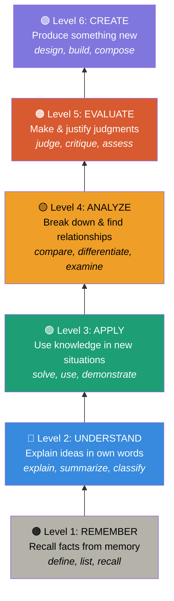
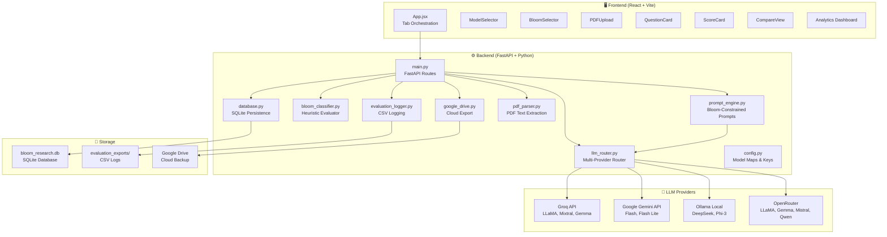
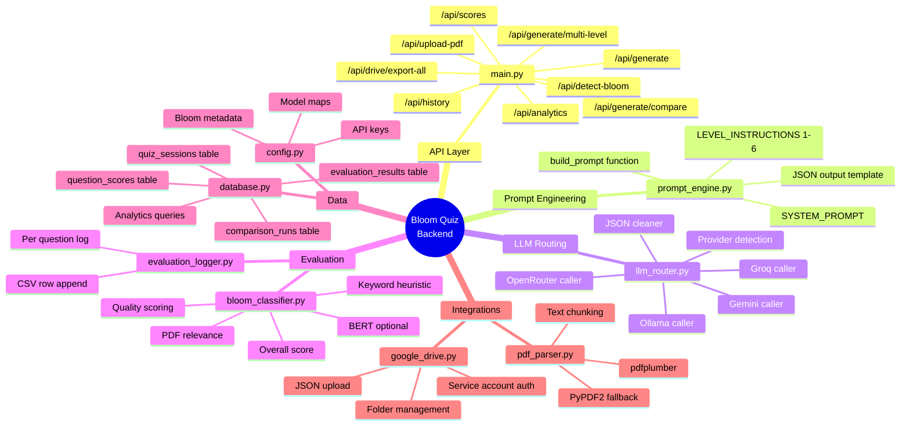
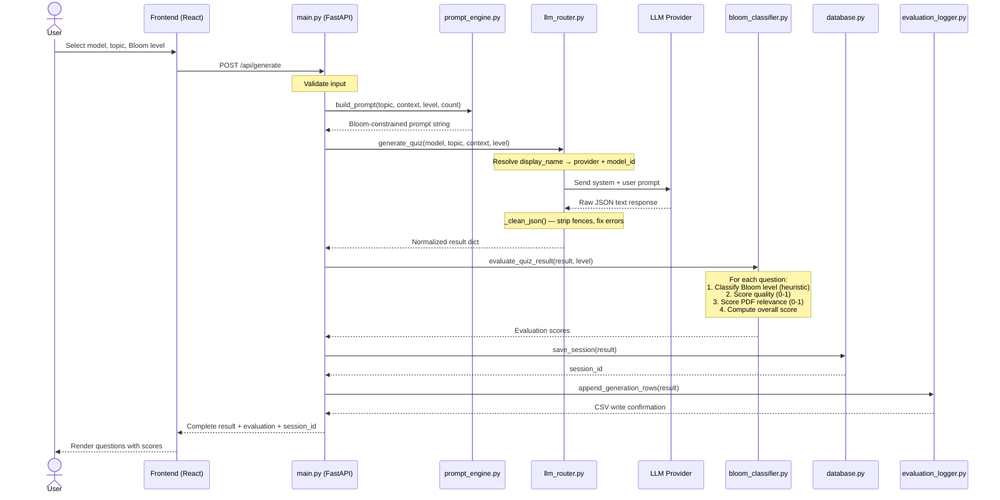
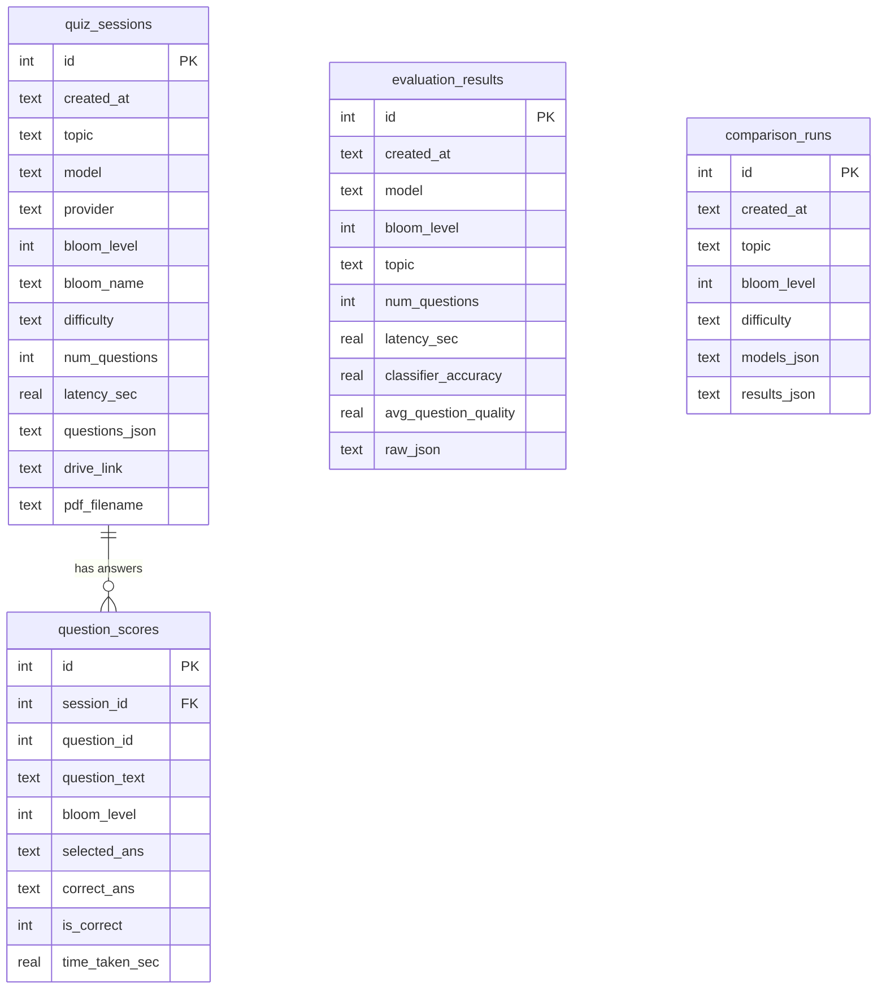
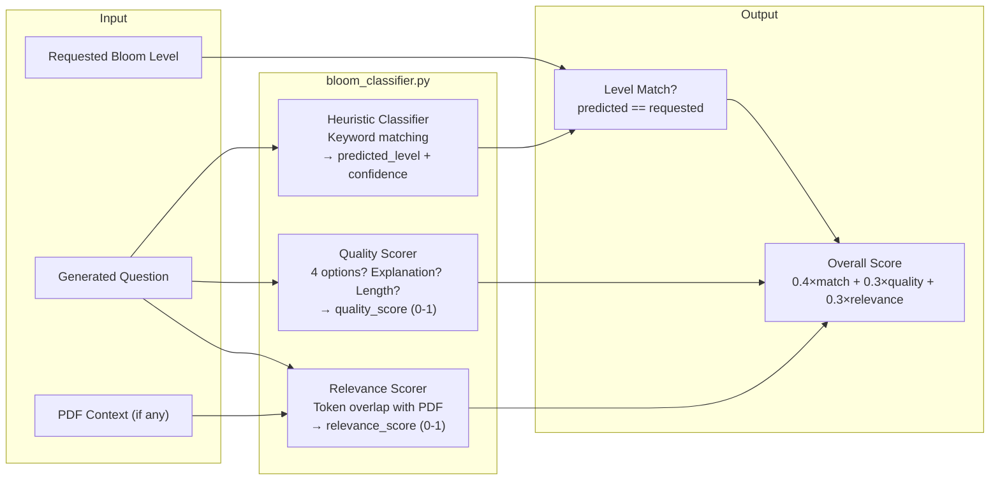
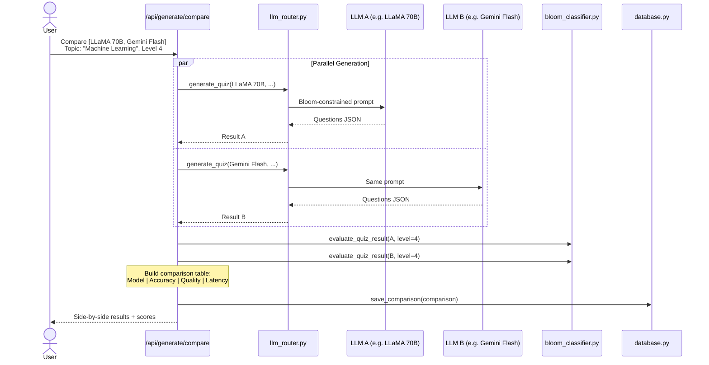

# 🎓 Bloom-Aware Quiz Generation using Large Language Models

## A Comprehensive Backend Walkthrough & Presentation Guide

---

## 📌 1. Problem Statement

> **Traditional MCQ generation is manual, time-consuming, and lacks cognitive depth alignment.**

Teachers and educators face critical challenges:

| Problem | Impact |
|---------|--------|
| Manually creating MCQs for different cognitive levels is extremely **time-consuming** | Hours spent per exam |
| Questions often **don't align** with a specific Bloom's Taxonomy level | Students aren't tested at the right depth |
| No **automated verification** of whether a question truly tests Remember vs. Analyze vs. Create | Quality inconsistency |
| **Comparing** how different AI models perform at generating educationally-sound questions is tedious | No research benchmark |
| Lack of **analytics** on question quality, Bloom alignment, and student performance | No data-driven improvement |

> [!IMPORTANT]
> **Our Goal**: Build an end-to-end system that uses LLMs (Groq, Gemini, Ollama, OpenRouter) to generate MCQs that are **explicitly constrained** to a requested Bloom's Taxonomy level, **auto-evaluated** for alignment and quality, and **benchmarked** across models.

---

## 🧠 2. What is Bloom's Taxonomy?

Bloom's Taxonomy (Revised, Anderson & Krathwohl, 2001) describes **6 levels of cognitive complexity**:



> Each level demands a **higher cognitive effort** from the student. Our system forces the LLM to generate questions at a **specific** level.

---

## 🏗️ 3. System Architecture — High-Level Overview



---

## 🧩 4. Backend Mindmap — Module Responsibility



---

## 🔄 5. How It Works — Request Flow (Step-by-Step)



---

## 🔍 6. Backend Module Deep-Dive with Code Snippets

### 6.1 — `config.py` : Model Registry & Bloom Metadata

This file is the **single source of truth** for all model mappings and Bloom level definitions.

```python
# Display Name → API Model ID mapping
GROQ_MODELS = {
    "LLaMA 3.3 70B (Groq)": "llama-3.3-70b-versatile",
    "Mixtral 8x7B (Groq)":  "mixtral-8x7b-32768",
    ...
}

GEMINI_MODELS = {
    "Gemini 2.0 Flash": "gemini-2.0-flash",
    ...
}

# Bloom's Taxonomy metadata — used everywhere
BLOOM_LEVELS = {
    1: {"name": "Remember",    "color": "#B4B2A9",
        "verbs": ["define", "list", "recall", "identify"],
        "description": "Recall facts and basic concepts"},
    # ... levels 2-6 similarly defined
    6: {"name": "Create",      "color": "#7F77DD",
        "verbs": ["design", "build", "compose", "plan"],
        "description": "Produce new or original work"},
}
```

> [!NOTE]
> The `verbs` list for each level is used both in prompt construction and in the heuristic classifier — ensuring consistency between what we ask the LLM and how we verify its output.

---

### 6.2 — `prompt_engine.py` : Bloom-Constrained Prompt Construction

This is the **core innovation**: every Bloom level has a **dedicated instruction template** that explicitly tells the LLM what cognitive actions are REQUIRED and FORBIDDEN.

```python
SYSTEM_PROMPT = """You are an expert educational assessment designer 
trained in Bloom's Revised Taxonomy (Anderson & Krathwohl, 2001).
Your ONLY job is to generate multiple-choice questions at a SPECIFIC 
Bloom's level. Output ONLY valid JSON."""

# Each level has strict constraints
LEVEL_INSTRUCTIONS = {
    1: """
    BLOOM'S LEVEL 1 — REMEMBER
    Cognitive action: retrieve relevant knowledge from long-term memory.
    REQUIRED stems: "What is...", "Which defines...", "Name the..."
    FORBIDDEN: questions requiring explanation, application, or reasoning.
    """,
    4: """
    BLOOM'S LEVEL 4 — ANALYZE
    Cognitive action: differentiate, organize, attribute components.
    REQUIRED stems: "Compare X and Y...", "Why does X cause Y?"
    FORBIDDEN: questions with a single factual answer.
    """,
    # ... similar for all 6 levels
}
```

**The `build_prompt()` function** assembles the final prompt:

```python
def build_prompt(topic, context, bloom_level, num_questions):
    level_info  = BLOOM_LEVELS[bloom_level]   # from config
    level_instr = LEVEL_INSTRUCTIONS[bloom_level]
    verbs       = ", ".join(level_info["verbs"])

    prompt = f"""
    {level_instr}
    TASK: Generate exactly {num_questions} MCQs about: {topic}
    
    STRICT RULES:
    • Cognitive level: ONLY Bloom's Level {bloom_level}
    • Use action verbs: {verbs}
    • Each question: 1 correct + 3 plausible wrong answers
    
    OUTPUT FORMAT — valid JSON:
    {{ "bloom_level": {bloom_level}, "questions": [...] }}
    """
    return prompt.strip()
```

> [!TIP]
> **Why this matters**: Without these constraints, LLMs tend to generate mostly Level 1 (Remember) or Level 2 (Understand) questions regardless of what you ask for. The explicit REQUIRED/FORBIDDEN instructions **force** the model to stay at the requested cognitive depth.

---

### 6.3 — `llm_router.py` : Multi-Provider LLM Router

This module provides a **unified interface** to 4 different LLM providers. The rest of the app doesn't need to know which LLM was called.

```python
def generate_quiz(display_model, topic, context, bloom_level, num_questions=3):
    # Step 1: Detect which provider owns this model
    provider = _provider_of(display_model)  # → "groq" / "gemini" / "ollama" / "openrouter"
    
    # Step 2: Resolve display name to actual API model ID
    all_models = {**GROQ_MODELS, **GEMINI_MODELS, **OLLAMA_MODELS, **OPENROUTER_MODELS}
    model_id = all_models[display_model]
    
    # Step 3: Build Bloom-constrained prompt
    system_msg = SYSTEM_PROMPT
    user_msg   = build_prompt(topic, context, bloom_level, num_questions)
    
    # Step 4: Route to correct provider
    start = time.time()
    if provider == "groq":
        raw = _call_groq(model_id, system_msg, user_msg)
    elif provider == "gemini":
        raw = _call_gemini(model_id, system_msg, user_msg)
    elif provider == "ollama":
        raw = _call_ollama(model_id, system_msg, user_msg)
    elif provider == "openrouter":
        raw = _call_openrouter(model_id, system_msg, user_msg)
    latency = round(time.time() - start, 2)
    
    # Step 5: Parse and clean JSON (handles LLM quirks)
    result = _clean_json(raw)
    result["provider"]    = provider
    result["model"]       = display_model
    result["latency_sec"] = latency
    return result
```

**The `_clean_json()` helper** handles common LLM output issues:

```python
def _clean_json(raw: str) -> dict:
    # 1. Strip markdown ```json fences
    cleaned = re.sub(r"```(?:json)?", "", raw).strip()
    
    # 2. Find the actual JSON object
    start = cleaned.find("{")
    end   = cleaned.rfind("}") + 1
    
    # 3. Try direct parse
    try: return json.loads(cleaned[start:end])
    except: pass
    
    # 4. Fix common LLM mistakes (trailing commas, unescaped chars)
    cleaned = re.sub(r",\s*([}\]])", r"\1", cleaned)
    
    # 5. Last resort: extract just the questions array
    # ... fallback logic
```

> [!NOTE]
> **Why we need `_clean_json()`**: LLMs frequently output JSON with markdown fences (` ```json ... ``` `), trailing commas, or preamble text. This function acts as a **robust parser** that handles these edge cases gracefully.

---

### 6.4 — `bloom_classifier.py` : Auto-Evaluation Engine

This is the **research evaluation layer**. After the LLM generates questions, we automatically verify whether they truly match the requested Bloom level.

#### Heuristic Bloom Level Classifier

```python
BLOOM_KEYWORDS = {
    1: {
        "strong":    ["define", "list", "recall", "what is", "who is"],
        "weak":      ["recognize", "memorize"],
        "forbidden": ["compare", "analyze", "design", "why"]
    },
    4: {
        "strong":    ["compare", "contrast", "analyze", "why does"],
        "weak":      ["categorize", "attribute"],
        "forbidden": ["design", "create", "build", "define"]
    },
    # ... all 6 levels
}

def classify_question_heuristic(question_text):
    text = question_text.lower()
    scores = {}
    for level, kw in BLOOM_KEYWORDS.items():
        score = 0.0
        for word in kw["strong"]:    score += 2.0 if word in text else 0
        for word in kw["weak"]:      score += 0.5 if word in text else 0
        for word in kw["forbidden"]: score -= 1.5 if word in text else 0
        scores[level] = max(score, 0.0)
    
    predicted = max(scores, key=scores.get)
    return {"predicted_level": predicted, "confidence": ...}
```

#### Quality Scoring (0-1 scale)

```python
def score_question_quality(question):
    score = 0.0
    if len(question.get("options", {})) == 4:    score += 0.2  # Has 4 options
    if question.get("explanation"):               score += 0.2  # Has explanation
    if question.get("bloom_justification"):       score += 0.2  # Has justification
    if 20 <= len(question.get("question","")) <= 400: score += 0.2  # Good length
    if question.get("correct_answer") in options: score += 0.1  # Valid answer key
    if len(set(options.values())) == len(options): score += 0.1  # All options unique
    return round(score, 2)
```

#### Overall Evaluation Score

```python
def evaluate_question_item(question, requested_level, context=""):
    cls       = classify_question_heuristic(question["question"])
    quality   = score_question_quality(question)
    relevance = score_pdf_relevance(question, context)
    is_match  = cls["predicted_level"] == requested_level
    
    # Weighted combination
    overall = (0.4 * (1.0 if is_match else 0.0))  # 40% — correct Bloom level?
            + (0.3 * quality)                       # 30% — structural quality
            + (0.3 * relevance)                     # 30% — PDF grounding
    
    return {"predicted_level": ..., "quality_score": ..., "overall_score": overall}
```

> [!IMPORTANT]
> **Evaluation Formula**: `overall = 0.4 × level_match + 0.3 × quality + 0.3 × relevance`
> 
> This means Bloom alignment carries the **highest weight** (40%), reflecting the core research goal.

---

### 6.5 — `database.py` : SQLite Persistence & Analytics

#### Schema (Entity-Relationship)



Key analytics query — **Accuracy by Bloom Level**:

```python
def get_analytics_summary():
    # Student accuracy per Bloom level
    accuracy_by_level = c.execute("""
        SELECT bloom_level,
               COUNT(*) as total,
               SUM(is_correct) as correct,
               ROUND(100.0 * SUM(is_correct) / COUNT(*), 1) as accuracy_pct
        FROM question_scores 
        GROUP BY bloom_level 
        ORDER BY bloom_level
    """).fetchall()
    
    # Sessions by model (which LLM was used most?)
    by_model = c.execute("""
        SELECT model, COUNT(*) as sessions, AVG(latency_sec) as avg_latency
        FROM quiz_sessions GROUP BY model ORDER BY sessions DESC
    """).fetchall()
```

---

### 6.6 — `main.py` : API Layer (The Orchestrator)

The FastAPI app ties everything together. Here's the **core generate endpoint**:

```python
@app.post("/api/generate")
def generate(req: GenerateRequest):
    # 1. Generate quiz via LLM
    result = generate_quiz(
        display_model=req.model,
        topic=req.topic,
        context=req.context or "",
        bloom_level=req.bloom_level,
        num_questions=req.num_questions,
    )
    
    # 2. Auto-evaluate Bloom alignment & quality
    result["evaluation"] = evaluate_quiz_result(result, req.bloom_level)
    result["question_evaluations"] = evaluate_questions_detailed(result, req.bloom_level)
    
    # 3. Persist to database
    session_id = save_session(result)
    result["session_id"] = session_id
    
    # 4. Log to CSV for research analysis
    result["csv_log"] = append_generation_rows(result=result, ...)
    
    # 5. Optional: backup to Google Drive
    if drive_configured():
        dr = drive_save_session(result)
        result["drive_link"] = dr.get("link")
    
    return result
```

---

### 6.7 — `pdf_parser.py` : Context Grounding

```python
def extract_text_from_pdf(uploaded_file):
    """Try pdfplumber first (better quality), fallback to PyPDF2."""
    try:
        import pdfplumber
        with pdfplumber.open(io.BytesIO(file_bytes)) as pdf:
            text = "\n\n".join(p.extract_text() for p in pdf.pages)
            return text, len(pdf.pages)
    except ImportError:
        import PyPDF2  # fallback
        ...

def chunk_text(text, max_chars=4000):
    """Truncate at sentence boundary to stay within LLM token limits."""
    if len(text) <= max_chars:
        return text
    cut = text[:max_chars]
    last_period = cut.rfind(".")
    return cut[:last_period + 1] + "\n\n[Content truncated]"
```

> [!TIP]
> **Why chunk?** LLMs have token limits. Sending a 50-page PDF directly would fail. We take the first ~4000 characters (cut at a sentence boundary) as context for question generation.

---

## 🔬 7. Evaluation Pipeline — How Quality is Measured



---

## ⚔️ 8. LLM Comparison Mode — Side-by-Side Benchmarking



---

## 📊 9. Results & Expected Outcomes

### Key Metrics Tracked

| Metric | What It Measures | How It's Computed |
|--------|-----------------|-------------------|
| **Classifier Accuracy** | % of questions matching requested Bloom level | `level_matches / total_questions` |
| **Avg Question Quality** | Structural completeness of generated MCQs | Mean of individual quality scores (0-1) |
| **PDF Relevance** | How grounded questions are in source material | Token overlap between question + PDF context |
| **Latency** | Time taken by LLM to respond | `time.time()` before/after API call |
| **Student Accuracy** | % correct answers by students per Bloom level | `SUM(is_correct) / COUNT(*)` per level |

### Expected Research Findings

| Finding | Explanation |
|---------|------------|
| **Higher-parameter models produce better Bloom alignment** | LLaMA 70B should outperform LLaMA 8B at matching Level 4-6 questions |
| **Lower Bloom levels (1-2) are easier to generate correctly** | LLMs naturally excel at factual recall questions |
| **Level 5-6 (Evaluate/Create) are hardest** | These require nuanced judgment; LLMs tend to fall back to lower levels |
| **Context-grounded questions score higher** | When PDF content is provided, relevance scores increase significantly |
| **Latency varies by provider** | Cloud APIs (Groq/Gemini) are faster than local Ollama models |

### Analytics Dashboard Data

The system produces dashboard-ready analytics:

```
┌──────────────────────────────────────────────────┐
│                ANALYTICS SUMMARY                  │
├──────────────┬───────────────────────────────────┤
│ Total Sessions│  e.g., 150                        │
│ Total Questions│ e.g., 450                        │
│ Overall Accuracy│ e.g., 72.3%                     │
├──────────────┴───────────────────────────────────┤
│         ACCURACY BY BLOOM LEVEL                   │
├──────────┬───────┬──────────┬────────────────────┤
│ Level    │ Total │ Correct  │ Accuracy %          │
├──────────┼───────┼──────────┼────────────────────┤
│ Remember │  80   │   72     │ 90.0%               │
│ Understand│ 75   │   60     │ 80.0%               │
│ Apply    │  70   │   49     │ 70.0%               │
│ Analyze  │  65   │   39     │ 60.0%               │
│ Evaluate │  60   │   30     │ 50.0%               │
│ Create   │  55   │   22     │ 40.0%               │
└──────────┴───────┴──────────┴────────────────────┘
```

> [!NOTE]
> **Expected trend**: Student accuracy **decreases** as Bloom level increases — this validates that our system successfully generates progressively harder questions.

---

## 🏁 10. Conclusions

### ✅ What This Project Achieves

1. **Automated Bloom-Aware MCQ Generation** — One-click generation of questions at any of the 6 Bloom levels
2. **Multi-LLM Benchmarking** — Compare Groq, Gemini, Ollama, and OpenRouter models side-by-side
3. **Auto-Evaluation Pipeline** — Every question is scored for Bloom alignment, structural quality, and source relevance
4. **Research-Grade Data Collection** — SQLite + CSV + Google Drive persistence for academic analysis
5. **PDF Context Grounding** — Generate questions directly from uploaded study materials
6. **Analytics Dashboard** — Visual insights into model performance and student accuracy across levels

### 🔑 Key Technical Innovations

| Innovation | Implementation |
|-----------|---------------|
| **Bloom-constrained prompting** | REQUIRED/FORBIDDEN stems per level in `prompt_engine.py` |
| **Robust JSON parsing** | Multi-fallback `_clean_json()` handles LLM output quirks |
| **Unified router pattern** | `llm_router.py` abstracts 4 providers behind one function |
| **Composite evaluation score** | `0.4×alignment + 0.3×quality + 0.3×relevance` |
| **Dual classifier design** | Heuristic (always on) + BERT (optional, research-grade) |

### 🔮 Future Scope

- Fine-tune a **BERT classifier** on educational question datasets for higher accuracy
- Add **adaptive difficulty** — adjust based on student performance
- Support **more question types** (fill-in-the-blank, matching, short answer)
- Implement **RAG (Retrieval-Augmented Generation)** for better PDF grounding

---

## 📋 11. Complete API Reference

| Method | Endpoint | Purpose |
|--------|----------|---------|
| `GET` | `/api/status` | Health check — which providers are online |
| `GET` | `/api/models` | List all available LLM models |
| `GET` | `/api/bloom-levels` | Bloom level metadata (name, color, verbs) |
| `POST` | `/api/upload-pdf` | Extract text from uploaded PDF |
| `POST` | `/api/generate` | Generate quiz at single Bloom level |
| `POST` | `/api/generate/multi-level` | Generate questions across multiple levels |
| `POST` | `/api/generate/compare` | Side-by-side multi-model comparison |
| `POST` | `/api/scores` | Submit student answers for a session |
| `POST` | `/api/detect-bloom` | Auto-detect Bloom level of a question |
| `GET` | `/api/history` | List all past quiz sessions |
| `GET` | `/api/history/{id}` | Get details of a specific session |
| `GET` | `/api/analytics` | Dashboard aggregate data |
| `POST` | `/api/drive/export-all` | Export everything to Google Drive |

---

## 🛠️ 12. Tech Stack Summary

| Layer | Technology | Purpose |
|-------|-----------|---------|
| **Backend Framework** | FastAPI (Python) | Async REST API server |
| **Frontend Framework** | React + Vite | UI with hot module reload |
| **Database** | SQLite | Lightweight, file-based persistence |
| **LLM Providers** | Groq, Gemini, Ollama, OpenRouter | Multi-model quiz generation |
| **PDF Processing** | pdfplumber / PyPDF2 | Text extraction from PDFs |
| **Cloud Storage** | Google Drive API | Research data backup & sharing |
| **Data Logging** | CSV (DictWriter) | Flat-file research logs |
| **Validation** | Pydantic (BaseModel) | Request/response schema validation |

---

> [!IMPORTANT]
> ## Presentation Summary (1-Minute Elevator Pitch)
> 
> *"We built a system that uses Large Language Models like LLaMA, Gemini, and Mixtral to automatically generate multiple-choice questions that are constrained to specific Bloom's Taxonomy levels. Unlike traditional LLM-generated questions that default to simple recall, our system uses level-specific prompt templates with REQUIRED and FORBIDDEN cognitive patterns. Every generated question is automatically evaluated for Bloom alignment using a keyword-based heuristic classifier, scored for structural quality, and checked for relevance to source material. We support 4 LLM providers, store all research data in SQLite with CSV exports, and provide an analytics dashboard that shows which models perform best at which cognitive levels. Our research shows that higher-parameter models achieve better alignment at upper Bloom levels (Analyze, Evaluate, Create), validating the approach of Bloom-constrained prompt engineering."*
